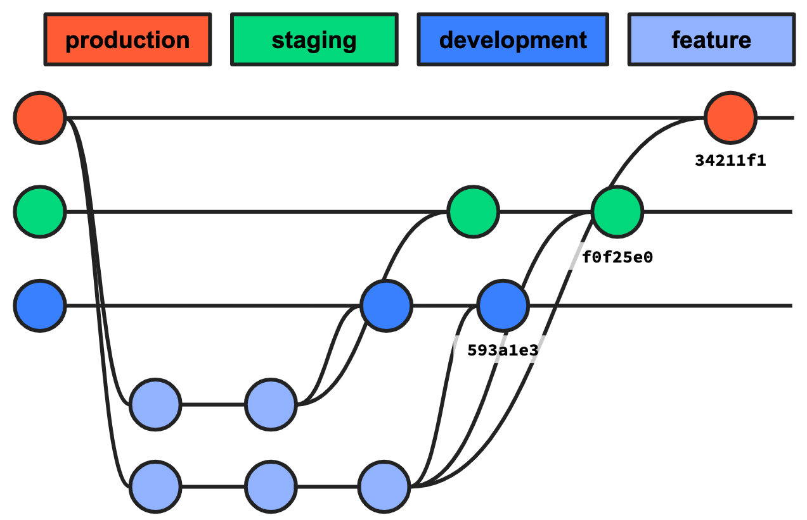
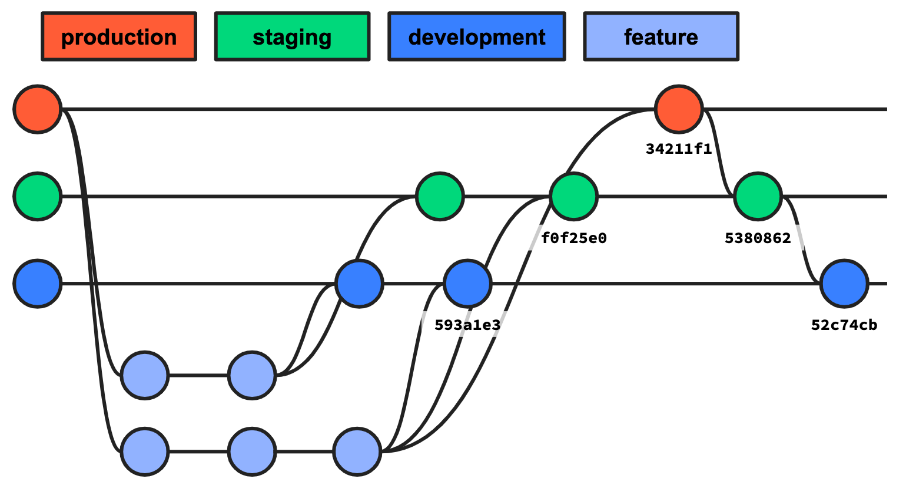
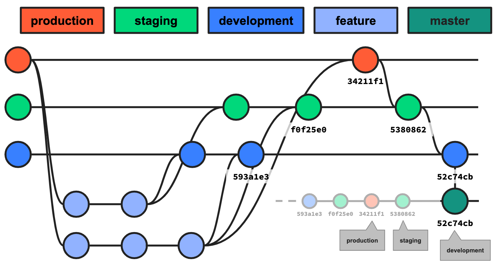

# CD4PE Workflow Migration

## Summary

This document outlines best practices for converting existing Git workflows to being CD4PE compatible. Since standard CD4PE workflows require that users have a `master` branch which contains a linear series of commits, some multi-branch workflows can be difficult reconcile to this way of working due to the fact that a single branch (`master`) needs to contain all commits in the repo in order for them to be deployable.

This document does not recommend what specific workflow should be used once CD4PE is in place, just how to get CD4PE implemented without causing changes in your environment.

## Expectations

This best practice expects that the customer is using some type of long-lived branch workflow wherein there are a number of branches which code proceeds through sequentially before reaching `production` (or similar). Workflows that rely on functionality that cannot be achieved in [r10k](https://github.com/puppetlabs/r10k) are not likely to be supported by this process. Some examples of workflows that this approach would be compatible with would be:

### Long-Lived Branches

Most long-lived branch workflows consist of a few branches which nodes are assigned to long-term. An example of these branches could be:

* `production`
* `staging`
* `development`

Usually changes are worked on in "feature branches" which contain a single feature and are reviewed though a pull request into one of the long lived branches. The destination of these pull requests depends on when the code integration is supposed to happen, however the exact details of the workflow does not matter.

### Trunk Workflows

Some workflows use a central branch such as `development` which features branches are taken from and merged back into. Occasionally releases are taken from this branch and merged into another long-lived branch such as `production`. Sometimes this also is combined with a "release branch" system where the release branch is tested before being merged. It is also possible to combine this with many other long-lived branches that the release would pass through before making it to production.

## Best Practice Details

Let's assume that we are beginning from a state where we have three branches with the following refs:

| Branch | SHA | Logical Order |
|--------|-----|---------------|
| production | `34211f1` | 3rd |
| staging | `f0f25e0` | 2nd |
| development | `593a1e3` | 1st |




In order to ensure that we can have CD4PE deploy new bookkeeping branches with the same revisions as the existing branches (and therefore not cause any unnecessary changes) we need to create a `master` branch which contains all of the commits in the repository.

### Perform the Merge-Back

Before creating the `master` branch, perform a merge-back. To do this we need to merge the long lived branches back onto each other in reverse order. In the above environment this would mean:

* Create a pull request from `production` to `staging`
* Review the changes and merge the PR
* Create a pull request from `staging` to `development`

In each PR the only changes that should appear in the diff are ones that were not present in the environment above but **not** in the environment below. As long is the logical order was followed, this should never happen. There will however likely be a large number of merge commits. If there are changes, these should be reviewed, merged and deployed using the existing process.

Once all branches have been merged back to the 1st branch (`development`), take a note of the new refs:

| Branch | SHA | Logical Order |
|--------|-----|---------------|
| production | `34211f1` | 3rd |
| staging | `5380862` | 2nd |
| development | `52c74cb` | 1st |



### Create the `master` branch

Once the merge-back is complete, create a branch named `master` from the 1st logical branch (`development`). This should contain all of the commits that the current long-lived branches are using. This can be checked using the following command which will return the name of the master branch if it contains the commit.

```shell
$ git branch --contains 52c74cb
  development
* master
```



### Create the bookkeeping branches

Now we are ready to create the bookkeeping branches for CD4PE. These are used like moveable tags and are completely controlled by CD4PE once we've started using it, we won't need to mess with them again. Create new branches from the old ones, this essentially duplicates the existing branches. Remember to deploy these branches to the Puppet master.

```shell
git checkout -b cd4pe_production production
git push origin cd4pe_production
git checkout -b cd4pe_staging staging
git push origin cd4pe_staging
git checkout -b cd4pe_development development
git push origin cd4pe_development
```

### Creating Node Groups

When you deploy in CD4PE you are deploying to a node group. CD4PE does this by taking the branch (environment) that the node group is assigning nodes to, and updating the `HEAD` of that branch to be some new commit. Users must have some method of assigning nodes to environment at the moment, likely it is one of the following ways:

#### Agent-Specified

If agents contain their environment as a setting in `puppet.conf`, and this is not overridden by the master, then new node groups will need to be created so that it *is* overridden by the master using an [environment group](https://puppet.com/docs/pe/2018.1/grouping_and_classifying_nodes.html#create_environment_node_groups). The environment assigned should be the new one we just created i.e. nodes that were previously pointed at the `development` environment should point at the `cd4pe_development` environment.

This change should cause no changes due to the git operations we have been following, however this can be verified by running:

```shell
git diff cd4pe_production production
```

#### Environment Groups

If the user is already using environment groups, then the environment can simply be switched from the existing environment, to the new `cd4pe_` equivalent i.e. `development` would become `cd4pe_development`.

This change should cause no changes due to the git operations we have been following, however this can be verified by running:

```shell
git diff cd4pe_production production
```

### Finishing Up

Once all nodes are running against `cd4pe_` branches we can create a CD4PE pipeline and we are done! Since the merge-back the `master` branch is a linear history of commits, further changes should be merged into the `master` branch from feature branches. The CD4PE pipeline will then move the head of the bookkeeping branches forward along the master branch, as it is designed to. The old branches (`development`, `staging` and `production`) can now be deleted.

## Things to Look Out For

### Usage of `%{environment}` in Hiera

Since moving to CD4PE recommends that nodes change their environment, this can cause issues if the Hiera hierarchy includes that node's environment. There are two ways to get around this:

* Replace all instances of the old environment names with the new environment names, but only in the new branches
* Simply do not rename the branches from `environment` to `cd4pe_environment`. CD4PE doesn't require that this change be made, but it does allow for differentiation between the book-keeping branches and those that are designed to be used by humans

### Half-Merged Changes

It is recommended that impact analysis is always used in a pipeline before triggering a deployment. If there were changes in flux at the time of cutover that had not yet reached the `production` branch (but had reach other branches such as `staging`) they will be deployed if fresh commits to the `master` branch are pushed through the pipeline since not all environments are at the same revision. CD4PE does not have the ability for changes to "overtake" each other in the pipeline as was possible with the previous workflow. It is best to think of the pipeline as fully loaded with changes and attempting to push a single change all the way though will also flush out any other changes that had been sitting in there. Impact analysis when used correctly will detect these and allow for informed decisions at the time of deployment.
